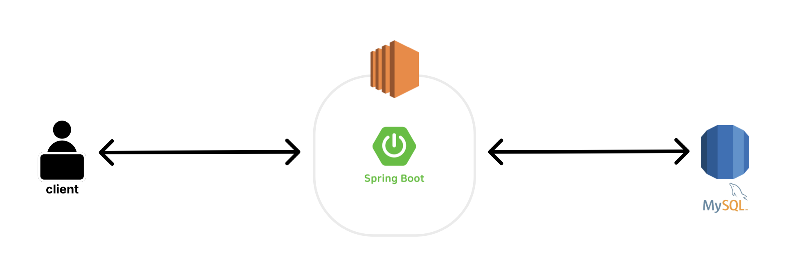

# FINAL PROJECT
 

 

 

## 이름 : Hello Mentor
## 설명 : 코딩 멘토/멘티 매칭 & 커뮤니티 웹 사이트
## 기간 : 2023.07.26 ~ 2023.09.21
## 인원 : 5명(팀프로젝트)
## 역할 : 조장, 메인 페이지 구현, 채팅 기능, 신고 기능
  
## 개발 환경
### 언어 : JAVA11, HTML, CSS, Javascript
### 프레임워크 : Springboot, Thymeleaf
### 라이브러리 : jQuery
### API : Thymeleaf API
### DB : MySQL, AWS RDS
### 서버 : Apache Tomcat
### IDE : IntelliJ
### ORM : MyBatis

 

## System Architecture

view

 

 

## ERD

view

 

 

 

## 소감
 

	<big>
		이 프로젝트를 통해 Git을 통한 버전 관리와 GitHub를 통한 협업 능력을 배양할 수 있었습니다.
		또한, Spring Boot를 통한 백엔드 개발로 다시 한번 MVC 패턴을 학습하며 스프링 어노테이션에 더욱 익숙해 질수 있었습니다. 물론 그 과정에서 Auto Configuration의 능력에 놀라기도 했습니다.
		새로운 템플릿 엔진인 Thymeleaf와 MySQL의 문법, STOMP 통신을 새로 익혀야 하는 과정에서 새로운 것을 배우는 것에는 공식 사이트를 찾아보는 것이 가장 좋다는 것도 깨달았습니다.
		마지막으로 처음으로 조장 역할을 하면서 조장의 자리란 결정과 동시에 책임을 져야하는 자리라는 것을 배웠습니다. 그리고 개발은 혼자 하는 것이 아니라 같이 하는 것임을 더욱 느낄 수 있던 프로젝트였습니다.
	</big>

 

 

## 나의 역할
 

- [메인페이지 & navi바](#메인페이지)
- [게시글 신고하기](#신고하기)
- [채팅](#채팅)

 
 

### 메인페이지

 
view

 

  
 

 
description

  
 

  <ul>
   <li>
    

     
게시글의 조회수/ 추천수 기준 TOP5 게시글만 조회

     
    

   </li>
   <li>
    

     
DB에서 게시판별 TOP5 게시글 SELECT

     
    

   </li>
  </ul> 
 

#### navi바

 
view

 

  
 

 
description

  
 

  <ul>
   <li>
    

     
프로필 이미지 호버시 스크롤 바 생성

     
    

   </li>
   <li>
    

     
회원별 열람 게시판 조절

     
    

   </li>
  </ul> 
 

 
 

### 신고하기

 
view

 

  
 

 
description

  
 

  <ul>
   <li>
    

     
신고하기 링크를 통해 신고 페이지로 이동

     
    

   </li>
   <li>
    

     
신고 INSERT

     
    

   </li>
  </ul> 
 

 
 

### 채팅

 
view

 

  
 

 
description

  
 

  <ul>
   <li>
    

     
UUID.randomUUID로 chatRoomDTO에 고유번호 생성 및 부여

     
    

   </li>
   <li>
    

     
StompWebSocketConfig

     
    

   </li>
   <li>
    

     
메세지 수신(sub)을 위한 StompChatController

     
    

   </li>
   <li>
    

     
메세지 발신(pub)을 위한 전송 button

     
    

   </li>
   <li>
    

     
메세지를 받자마자 화면에 랜더해주는 SocketJS

     
    

   </li>
  </ul> 
 

